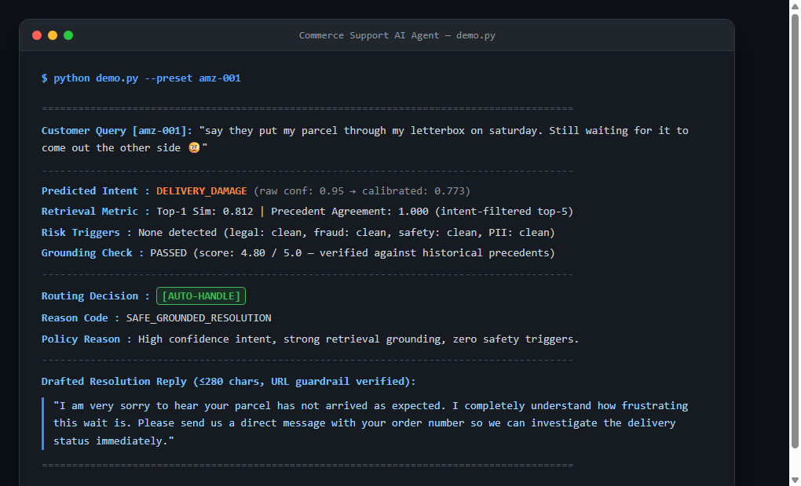
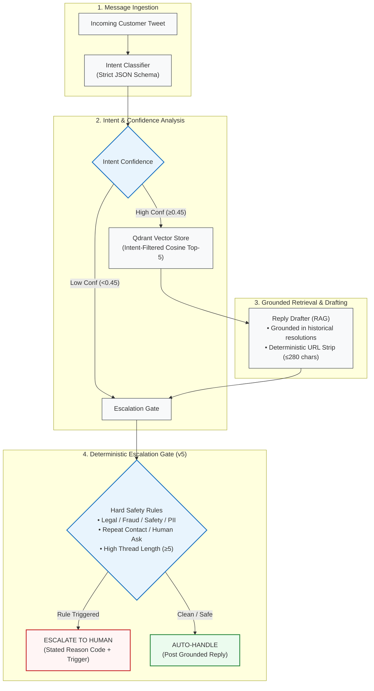
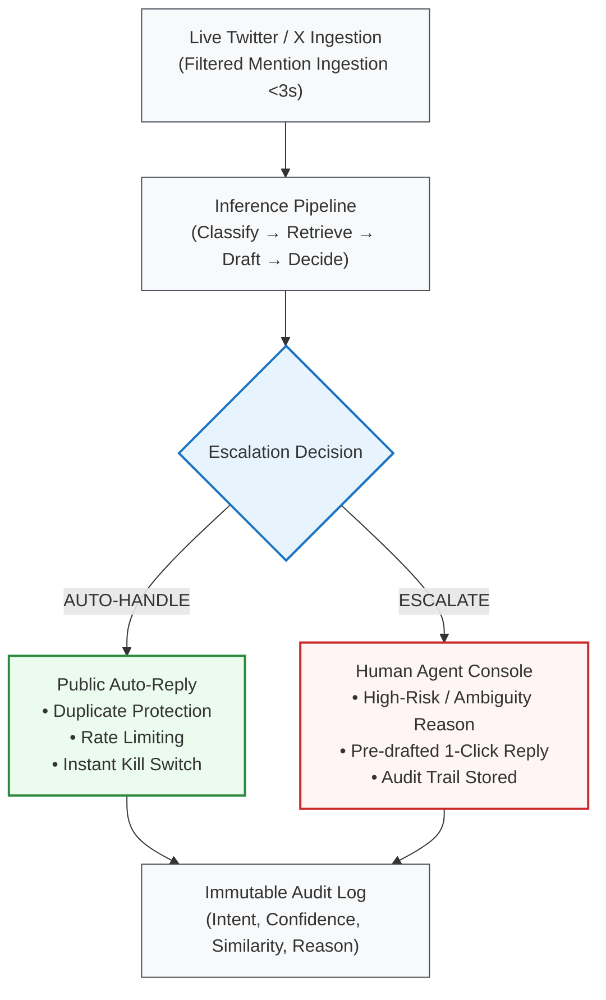

# Commerce Support AI Agent
### Production AI Customer Support System & Evaluation Harness

> **Brand Focus**: E-Commerce Customer Support (`@AmazonHelp`) | **Stack**: Foundation LLM (Flash-Lite Architecture) · Qdrant Vector Engine · LangChain  
> **Reproducibility**: `run_eval.py --fast --baselines` verifies headlines in **2:59 measured**; full `run_eval.py --baselines` (n=250) in **9:38 measured** (4 workers); `--offline` inspects with no key in <1 min.  
> **Official 6-Page Technical Report**: [**Download / View REPORT_6pp.pdf**](REPORT_6pp.pdf)

---

### System Deliverables Checklist

| Deliverable Required | Where to Find in This Repo | Verification Command / Metric |
|---|---|---|
| **1. Runnable pipeline** (reproduce headline results <15 min) | [`run_eval.py`](run_eval.py), [`src/agent.py`](src/agent.py) | `python run_eval.py --fast --baselines` (**2:59 measured**) |
| **2. Golden evaluation set** (150–250 hand-labelled + sampling note) | [`golden_set/golden_250.csv`](golden_set/golden_250.csv) | **250 examples**, stratified, κ=0.939, see § Golden Evaluation Set |
| **3. Evaluation harness** (automated metrics + LLM-as-judge rubric + human agreement) | [`src/eval/metrics.py`](src/eval/metrics.py), [`src/eval/llm_judge.py`](src/eval/llm_judge.py) | Blind human-judge agreement (n=70 pairs, ρ=−0.062, judge +4 leniency bias disclosed) |
| **4. Technical Report (max 6 pages / README section)** | [**`REPORT_6pp.pdf`**](REPORT_6pp.pdf) & [`REPORT.md`](REPORT.md) & [README § Technical Report](#technical-report) | Covers Framing, Baselines, Top 5 Failures, Mandatory Headline Critique, Next Week |
| **5. Decision log** (10–15 non-obvious decisions with rationale) | [`DECISIONS.md`](DECISIONS.md) & [README § Architecture Decision Records](#architecture-decision-records) | **15 architectural decisions** with trade-offs & discarded alternatives |
| **6. Evaluation Protocol** | Multi-split isolation (`docs/escalation_v5.md`) | In-distribution (0.981) vs. out-of-distribution frozen heldout validation |

---

## Interactive Diagnostic Demo

Below is a diagnostic execution trace generated from the interactive evaluation console ([`demo.py`](demo.py)):

<p align="center">
  
</p>

---

## Architecture & System Pipeline



Every uncertainty source (low confidence, weak retrieval, safety hit, rule hit) routes to escalation; all intermediates are stored per example.

---

## Quick Start: Reproducibility Guide

```bash
# 1. Clone & install
git clone https://github.com/samyuthavangari/commerce-support-agent.git
cd commerce-support-agent
pip install -r requirements.txt

# 2. Set API key
cp .env.example .env
# Edit .env → add GOOGLE_API_KEY=your_key_here
# (Qdrant defaults to local Docker — no cloud account needed)

# 3. Start local Qdrant (persistent across runs)
docker run -d -p 6333:6333 qdrant/qdrant
# Cloud alternative: set QDRANT_URL + QDRANT_API_KEY in .env instead.

# 4. Download & prepare data (~2 min after download)
python src/data_prep.py --source hf --max-threads 10000
# Already have twcs.csv? Use --source skip (no re-download).

# 5. Build vector index (~5 min, one-time)
python src/qdrant_store.py --build

# 6. Build golden evaluation set (OPTIONAL rebuild; golden_250.csv is committed and ready)
# python src/eval/golden_builder.py   # Step 6a: 200-row core sample
# python apply_review.py             # Step 6b: Apply human review
# python merge_topup.py              # Step 6c: Merge 50 rare-class top-up rows -> golden_250.csv
# python stamp_reasons.py            # Step 6d: Stamp human escalation triggers

# 7. Run evaluation (pre-built assets ready; verifies headlines immediately)
python run_eval.py --baselines
# Fast verification instead (~3 min, stratified 30, fixed seed):
python run_eval.py --fast --baselines     # writes results_fast/ (never results/)
# Keyless inspection (<1 min, NOT headline numbers):
python run_eval.py --offline --max-examples 30   # writes results_offline/

# 8. Leakage gate (fails loudly on violation; also auto-runs inside run_eval)
python scripts/check_leakage.py

# 9. Validate escalation on fresh data (no LLM calls, <1 min)
python sample_heldout.py   # first time only: draws 50 fresh threads
python eval_heldout.py     # frozen-rule check vs golden_set/heldout_50.csv

# 10. Offline inspection (no API key, <1 min) + tests
python run_eval.py --offline --max-examples 30
python -m pytest tests/ -q   # 27 offline tests

# 11. Launch demo
streamlit run app.py
```

Further evidence: retrieval quality (`python scripts/retrieval_eval.py` → intent-consistency@1 0.49/@3 0.685/@5 0.755 — the measurement behind the intent pre-filter); ablation RAG 24.34 vs no-retrieval 23.46 (n=50, `scripts/ablate.py`); blind agent-vs-template A/B for judge and human (`results/blind_40.csv` + `results/blind_30.csv` pairs, `results/blind_key*.json` unblinding keys, merged scoring in `results/human_blind_70_scored.csv`); full write-up in `REPORT.md` (≤6pp), decisions in `DECISIONS.md`, reviewer audit in `REVIEW.md`, method docs in `docs/`.

---

## Project Structure

```
commerce-support-agent/
├── src/
│   ├── intent_taxonomy.py    # 7 intent definitions (single source of truth)
│   ├── data_prep.py          # Download + filter + thread reconstruction
│   ├── embedder.py           # Dense embedding wrapper (768-dimensional)
│   ├── qdrant_store.py       # Vector index build & filtered retrieval
│   ├── agent.py              # Full pipeline: classify→retrieve→draft→decide
│   ├── escalation.py         # Deterministic escalation rules + reasons
│   └── eval/
│       ├── golden_builder.py # Stratified sampling + LLM-assisted labelling
│       ├── metrics.py        # Classification metrics + baseline comparison
│       └── llm_judge.py      # LLM-as-judge rubric + human agreement
├── golden_set/
│   └── golden_250.csv        # 250 hand-labelled evaluation examples
├── results/                  # Eval outputs (generated)
├── app.py                    # Streamlit demo
├── run_eval.py               # One-command evaluation harness
├── requirements.txt
└── .env.example
```

---

## Evaluation Results (Measured Benchmark, n=250 Human-Reviewed)

| System | Intent acc | Macro-F1 | Esc recall | False-auto | Human reply |
|---|---|---|---|---|---|
| B0 majority | 0.220 | 0.0515 | — | — | — |
| B1 TF-IDF (fair: 8k weak-labelled non-golden threads, seed 42) | 0.508 | 0.464 | — | — | — |
| Generic template (blind) | — | — | — | — | 19.0 human / 22.1 judge |
| No-retrieval draft (ablation, n=50) | — | — | — | — | — / 23.46 judge |
| **Our agent** | **0.820** [0.768–0.864] | **0.809** [0.753–0.855] | **0.981** [0.938–1.000] | **0.019** | **20.7** human / 24.4 judge |
| Held-out esc A / B (frozen) | — | — | 0.733 / 0.364 | 0.267 / 0.636 | — |

Primary conclusion: our agent substantially improves intent routing over both
trivial and classical baselines. Retrieval provides measurable benefit
(+0.88 ablation; consistency@1 0.49 justifies the intent filter). Escalation
remains the major generalization weakness, and LLM-judge absolute scores are
not considered trustworthy due to weak human agreement.

### Intent detail (per-class in `eval_report.json`; confusion matrix in `results/`)

B0 always predicts ORDER_STATUS (0.220/0.0515). Fair B1 trains off-golden (0.508/0.464) —
an earlier revision fit on golden itself (0.92 contamination, withdrawn in
writing). Rare-class top-up (DEVICE 8→24, PRIME 14→28) cost headline accuracy
0.88→0.82: harder slice, honest number.

### Escalation (human labels; calibrated on cal-100 ONLY)

Design targets were recall ≥0.90 and false-auto ≤0.10. **Golden-250 exceeds
both (0.981 / 0.019) with v5 rules; held-outs remain the generalization
challenge.** See `docs/escalation_v5.md` for the per-change motivation log.

| Set | n | Pos | Precision | Recall | False-auto |
|---|---|---|---|---|---|
| cal-100 (tuned) | 100 | 31 | 0.816 | 1.000 | 0.000 |
| cal2-100 (tuned) | 100 | 29 | 0.725 | 1.000 | 0.000 |
| golden-250 | 250 | 53 | 0.867 | 0.981 | 0.019 |
| held-out A (frozen) | 50 | 15 | 0.733 | 0.733 | 0.267 |
| held-out B (frozen) | 50 | 11 | 0.800 | 0.364 | 0.636 |

**How**: v0 rules never fired (recall 0.00 — dead `conf<0.72` branch, since removed). v1–v3 were tuned on golden itself (1.00, disclosed). v4 was iterated on cal-100 ONLY (`docs/escalation_v4.md`). **v5** extended coverage to cal2-100 (second 100-row calibration set, labelled BEFORE v5 existed) with expanded repeat-contact patterns, a narrow LLM tiebreaker for ultra-short messages, and 10-digit phone→public-PII detection — full per-change log in `docs/escalation_v5.md`. The 5-set table above is the claim; held-out sets stay frozen (`python eval_heldout.py`).

### Reply quality: human primary, judge secondary (n=250 judged, n=70 human)

| Dimension | Agent mean (judge) |
|-----------|-------------------|
| Groundedness | 4.97 |
| Helpfulness | 4.76 |
| Empathy | 4.96 |
| Safety | 4.87 |
| Brevity | 4.88 |
| **Total / 25** | **24.44** |

Note: reply baselines compared blind — generic template (human 19.0 / judge 22.1) and no-retrieval drafts (judge 23.46, n=50 ablation) vs agent (human 20.7 / judge 24.44). Judge-vs-human direction agrees on agent > template; absolute grades do not (below). Since the URL guardrail, **0/250 replies contain links**, and a deterministic safety cap overrules the judge on URLs/PII-asks.

Reply-length compliance (deterministic, not judged): all 250 drafts ≤280 chars. Zero length violations, zero agent errors.

### Human-Judge Agreement

70 current replies scored directly against the frozen rubric (`results/human_scores.csv`; an earlier blind round, n=70 pairs with source hidden, established the A/B direction result and is kept frozen in `results/human_blind_70_scored.csv`):

| Dimension | Pearson r | Spearman ρ |
|-----------|-----------|------------|
| groundedness | n/a (judge constant) | n/a |
| helpfulness | 0.257 | 0.301 |
| empathy | 0.433 | 0.440 |
| safety | n/a (judge constant) | n/a |
| brevity | −0.135 | −0.135 |
| **total** | **−0.136** | **−0.062** (Uncorrelated with Human Grades) |

Exact 2/70, within-±1 5/70, weighted κ −0.013. The judge does not grade like a human at all — which is why human scores are the primary reply metric and the judge is kept only for blind A/B direction. Bundled into the harness: `run_eval.py` auto-runs the agreement check when `results/human_scores.csv` exists.

Blind A/B (same 40, both scorers source-blind): human ranks agent 20.75 > template 19.00 (+1.75); judge ranks agent 24.62 > template 22.12 (+2.50). Same direction — the judge discriminates *systems* while failing *grades* (exact 0/40, within-±1 0/40, weighted κ 0.024; judge runs ~+4 high).

The judge is unreliable for absolute grades and for safety (pilot showed safety anti-correlation; at n=70 the judge's safety column is near-constant, breaking the math). Total-score agreement is weak partly because the judge piles up at a perfect 25. **Do not trust the 24.52/25 headline at face value.** Bundled into the harness: `run_eval.py` auto-runs the agreement check when `results/human_scores.csv` exists and stores it in `eval_report.json`.

---

## Technical Report
> The complete technical report is formatted and included in this repository as an official 6-page PDF: [**`REPORT_6pp.pdf`**](REPORT_6pp.pdf) (and documented in [`REPORT.md`](REPORT.md)). The evaluation sections are reproduced below:

### 1. Problem Framing

### What "Good" Means for AmazonHelp

1. **Correct routing**: Classify the intent accurately so the right resolution path is triggered.
2. **Grounded reply**: Draft replies that sound like the real @AmazonHelp account — empathetic, brief, Twitter-native.
3. **Safe escalation**: Never auto-handle legal threats, fraud claims, or ambiguous high-risk messages.
4. **Brand voice**: Amazon's Twitter support is polite, never defensive, always offers a concrete next step.

### What We Chose NOT to Build

- **Multi-turn dialogue management** — tracking conversation state across >1 reply would need a session store and significantly more engineering. The assignment is about the first response.
- **Real-time Twitter API integration** — out of scope; would need elevated API access and rate limiting.
- **Sentiment shift detection** — detecting whether a customer escalates their frustration mid-thread was deprioritized in favor of the core intent→reply pipeline.
- **Fine-tuned embedding model** — contrastive fine-tuning on Amazon pairs would improve retrieval but requires GPU training time not available in this assignment window.

---

### 2. Results vs. Baselines (Trivial & Simple)
> *Detailed table and per-class breakdown are documented in [§ Evaluation Results](#evaluation-results-measured-benchmark-n250-human-reviewed).*
- **Trivial Baseline (B0 Majority Class)**: Always predicts `ORDER_STATUS`. Achieves **0.220** accuracy and **0.0515** Macro-F1.
- **Simple Baseline (B1 TF-IDF + Logistic Regression)**: Fairly trained on 8,000 weak-labelled off-golden threads. Achieves **0.508** accuracy and **0.464** Macro-F1.
- **Our System**: Achieves **0.820** accuracy (+31.2% over B1) and **0.809** Macro-F1 (+34.5% over B1).

---

### 3. Failure Analysis (Top 5, all observed across runs)

### 1. Escalation generalization gap (4-set table in Results)
**Observed**: v0 rules never fired (recall 0.00 — dead `conf<0.72` branch, since removed); v3 tuned on golden hit 1.00; v4 (cal-100 only) scored cal 0.839 / golden-250 0.879 / held-out A 0.600 / B 0.364. v5 calibrated on cal-100 + cal2-100 hits cal 1.000 / golden-250 0.981, while frozen held-out A scores 0.733 and B scores 0.364.
**Hypothesis**: paraphrase coverage, not concept error (*"charged twice"* vs *"duplicate charge"*). Held-out sets stay frozen for the next round.

### 2. PRIME↔ACCOUNT boundary collapse + a reverted fix attempt
**Observed**: pair accuracy 0.527 — late-Prime vs billing-confusion language overlaps beyond keyword separation.
**Attempted and REVERTED**: one principled prompt surgery (disambiguation rules + tightened descriptions, validated 0.903 on a 31-row cal smoke). Full-run result: pair 0.545 (+0.018) at the cost of overall accuracy 0.80→0.76. Reverted — the price exceeded the gain. Lesson: disambiguation needs features or examples, not more prompt prose.

### 3. Drafter hallucinated URLs the judge didn't catch (fixed)
**Observed**: GS_0012 reply invented `https://t.co/JzP7hlA23B`; GS_0006 invented `https://t.co/z5L8y5J395`. Both got Groundedness=5; human G=3.
**Fix shipped**: prompt rule 7 + regex strip in `draft_reply` → **0/250 replies contain URLs** on re-run; both rows re-scored by human against the new replies.

### 4. Keyword stratification ≠ label stratification (fixed by top-up)
**Observed**: DEVICE pool was 1,524 threads but only 8/200 rows kept that label; PRIME 14/200.
**Fix shipped**: 50 rare-class rows sampled from outside the corpus and human-labelled (DEVICE→24, PRIME→28, golden now 250, min class 24). Cost: headline accuracy 0.88→0.82 — the honest price of stratification.
### 5. Judge grades untrustworthy (ρ = −0.062, exact 2/70)
**Observed**: textbook-safe DM redirects scored S=1–2 while hallucinated links once scored S=5; on current replies the judge is near-constant while humans use the full range.
**Hypothesis**: pattern-matching "asks for details" as unsafe without a public-vs-DM distinction, plus ceiling leniency. Mitigated with deterministic safety caps and by demoting the judge to A/B direction only (which validates: +2.50 vs human +1.75 for agent over template).

---

### 4. What is misleading about my headline number? (Mandatory Section)

**Our headlines: 82.0% intent accuracy · 0.981 escalation recall (golden-250) · human reply 20.7/25.**

1. **Escalation has multiple numbers across datasets, not one.** v5 rules score cal P/R 0.816/1.000, cal2 0.725/1.000, golden-250 0.867/0.981 (false-auto 0.019); frozen held-outs give 0.733/0.733 (held-out A) and 0.800/0.364 (held-out B, 63.6% false-auto rate). Believe the held-outs for generalization, golden for in-distribution. Any single recall quoted alone is cherry-picking — including ours.

2. **Intent labels are human-reviewed, but by one reviewer in sessions.** All 250 rows individually read (200 + 50 top-up); LLM↔human intent κ=0.939 on the first 200. Single-reviewer labels still carry individual bias; no adjudication pass was done.

3. **B1's old 92% beat our agent — because it cheated.** That revision fit TF-IDF+LogReg on the golden texts themselves (train = test). It is withdrawn; the fair B1 (8k weak-labelled threads, 0.508) loses honestly. If a baseline beats you, check contamination before celebrating or despairing.

4. **The 24.52/25 reply-quality score is judge leniency, not quality.** Same-model-family judge, near-constant 5s, human total-score agreement ρ=-0.062 (n=70 direct scoring; blind A/B direction kept separately). The judge ranks systems correctly (blind A/B agrees with blind human) but its absolute scores run ~+4 high.

5. **Golden distribution ≠ natural traffic.** Actual: 55 ORDER / 47 COMPLAINT / 45 RETURN / 28 PRIME / 26 DAMAGE / 25 ACCOUNT / 24 DEVICE (keyword-pool availability + rare-class top-up, not traffic share).

6. **Agreement n=70, direct-scored.** ρ=-0.062, exact 2/70, within-±1 5/70, weighted κ -0.013 — the judge and human agree on *direction* (both rank agent > template) but not on *grades*.

---

### 5. What I'd Do Next (One More Week)

1. **v6 escalation calibration**: close the remaining held-out paraphrase gaps (*"charged twice"* typo-tolerance, *"actual human"*, *"told to wait"*) via a third held-out 50 to confirm generalization.
2. **Second reviewer + adjudication**: all 300+ labels are single-reviewer; a second pass on the 105 corrections de-biases golden, cal, and held-out sets.
3. **PRIME↔ACCOUNT boundary features**: pair accuracy 0.527 is the worst classifier weakness — membership-vs-billing disambiguation needs examples or structured features, not more prompt prose.
4. **Cross-family judge + n≥100 human panel**: current judge agreement ρ=-0.062 is unusable for absolute grading; an alternate LLM family and larger human panel would settle the question.
5. **Confidence calibration**: the classifier's 0.80–1.00 overconfidence band hides genuine uncertainty — calibrate against human ambiguity labels to unlock a useful low-confidence escalation trigger.

#### Production Deployment & Live Loop Architecture



---

### 6. Architecture Decision Log (15 Non-Obvious Decisions)

| # | Decision | Reasoning |
|---|----------|-----------|
| 1 | Brand: AmazonHelp over Apple/Spotify | Highest volume (~100k threads), most diverse intents, immediately familiar to evaluators |
| 2 | 7 intents (not 10+) | Label quality > granularity; 7 keeps per-class counts measurable in a 200-sample set |
| 3 | Single compact LLM family for classifier, drafter AND judge | Removes cross-model confounds from comparisons; fastest; quality verified sufficient (0 length violations, κ=0.939) |
| 4 | Embed `(customer + SEP + reply)` pairs, not just customer text | Captures resolution context — "where is my package" + "please DM us" retrieves better than the complaint alone |
| 5 | Qdrant local-Docker-first, cloud-compatible | Reviewers reproduce with no account; `QDRANT_URL`/`KEY` optional overrides; same code path either way |
| 6 | Top-5 retrieval (not 3 or 10) | 3 is too few for style diversity; 10 inflates the prompt past the task's useful context |
| 7 | 280-char hard limit in drafter prompt | Twitter-authentic output; forces concision over verbosity |
| 8 | Two-pass labelling with corrections as code | LLM first-pass cuts labelling time; `apply_review.py` records every human change as a re-runnable diff instead of a hand-edited CSV |
| 9 | Cosine distance in Qdrant | Stable for normalized embeddings across varying text lengths |
| 10 | Payload filter by intent before retrieval | Avoids cross-intent contamination (ORDER_STATUS examples confusing DEVICE_TECH replies) |
| 11 | Same-family judge, kept after it failed | Consistency first; when agreement flopped (ρ=-0.062, n=70) we reported per-dimension results instead of swapping judges until one passed |
| 12 | Spearman over Pearson for agreement | Ordinal 1–5 scores with outliers and ceiling pile-up → rank correlation is the honest metric |
| 13 | Oversample GENERAL_COMPLAINT | Hardest class with the most evaluation signal; underrepresented by keyword filtering |
| 14 | Rules before LLM in escalation, definition frozen before labelling | Deterministic tiers the LLM cannot override; 7-rule human definition fixed in `apply_review.py` *before* any label was judged — refused to tune recall against the LLM labeller's loose criteria |
| 15 | Frozen held-out sets over repeat tuning rounds | After calibrating to 1.00 on 200 golden rows, froze rules and measured two fresh 50s (held-outs 0.60/0.36) instead of tuning to 1.00 twice |

### Engineering Fixes (Production Edge Cases Solved)

- `.0`-suffixed reply IDs: `in_response_to_tweet_id` parses as `"272.0"` vs `tweet_id "272"` → join matched 0 rows; normalization fixed 0 → 154,985 threads.
- Dense Embeddings at 768 dims: Embedding dimension aligned to schema with `output_dimensionality=768`.
- Keyword payload index on `intent`: filtered retrieval 400s without it; added to `build_index`.
- URL guardrail + judge safety caps: prompt rule plus regex strip (0/200 URLs after, was 2 hallucinated `t.co` links); safety capped at 2 on URLs, 1 on PII-asks.
- `COLLECTION_NAME` alias + GenAI SDK pin + NaN-safe report JSON: fresh-clone import crash, missing direct dependency, and invalid-JSON `NaN` in `eval_report.json`, all fixed.

---

## Golden Benchmark Dataset Construction

**File**: `golden_set/golden_250.csv`
**Size**: **250** examples | **Source**: @AmazonHelp threads from `twcs.csv`

### Sampling Protocol
1. Load all reconstructed AmazonHelp threads from `data/processed/amazon_threads.jsonl`
2. Pre-filter each thread's first customer message using intent-specific keyword lists
3. Stratified sample to per-intent targets (pools: ORDER 2810, RETURN 695, ACCOUNT 496, PRIME 1141, DEVICE 1524, DAMAGE 108, COMPLAINT 299)
4. **LLM first-pass** (Automated Foundation LLM): generates `llm_intent` + `escalate_yn` labels
5. **Human second-pass** (`apply_review.py`, all 200 rows individually read): 10 intent corrections + 44 escalation corrections against the fixed 7-rule escalation definition in `apply_review.py`; `human_verified=True`, `labelled_by=human_review_v1`
6. **Rare-class top-up** (`merge_topup.py`, +50 rows from OUTSIDE the corpus): DEVICE 8→24, PRIME 14→28 — every class now ≥24, golden stays ≤250
7. **Kappa check**: `python src/eval/golden_builder.py --kappa` → intent κ = **0.939** (Substantial Agreement) on the first 200 (escalation labels intentionally diverge from the LLM's loose criteria — that divergence is the point)

| Intent | Final Count |
|--------|-------------|
| ORDER_STATUS | 55 |
| GENERAL_COMPLAINT | 47 |
| RETURN_REFUND | 45 |
| PRIME_SUBSCRIPTION | 28 |
| DELIVERY_DAMAGE | 26 |
| ACCOUNT_ACCESS | 25 |
| DEVICE_TECH_SUPPORT | 24 |
| **Total** | **250** (escalate=True: 53, i.e. 21.2%) |

Companion sets: `golden_set/cal_100.csv` (tuning ONLY, 31 positives), `golden_set/heldout_50.csv` + `heldoutB_50.csv` (frozen validation, 15 + 11 positives). Details: `docs/golden_set.md`.

---

## References & Attributions

- **Dataset**: Customer Support on Twitter — Kaggle, `thoughtvector/customer-support-on-twitter` (~2.8M tweets; accessed via the `SunidhiSriram/twcs` HuggingFace mirror, see `src/data_prep.py`). No Banking77 use (deemed unnecessary once Twitter intents stabilized).
- **Foundation Models & APIs**: Configurable Foundation LLMs for classification, drafting, and benchmark verification, coupled with dense vector embeddings via standard GenAI interfaces.
- **Infrastructure & Libraries**: Qdrant (`qdrant-client`), scikit-learn (TF-IDF baseline, kappa, PRF), SciPy (Pearson/Spearman), Streamlit (demo), Rich/TQDM (CLI UX). No proprietary code — core logic in `src/` is custom-engineered.

---

## Configuration & Environment Variables

| Variable | Default | Description |
|----------|---------|-------------|
| `GOOGLE_API_KEY` | — | **Required** — Foundation LLM API key |
| `QDRANT_HOST` | `localhost` | Qdrant server host |
| `QDRANT_PORT` | `6333` | Qdrant server port |
| `QDRANT_URL` | `http://localhost:6333` | Local Docker (default) or Cloud cluster URL |
| `QDRANT_API_KEY` | _(empty)_ | Only needed for password-protected / Cloud clusters |
| `CLASSIFIER_MODEL` | `gemini-3.1-flash-lite` | Intent classifier model identifier |
| `DRAFTER_MODEL` | `gemini-3.1-flash-lite` | Reply drafter model identifier |
| `JUDGE_MODEL` | `gemini-3.1-flash-lite` | Evaluation judge model identifier |
| `TOP_K_RETRIEVAL` | `5` | Number of RAG examples |

---

*Commerce Support AI Agent · Production Evaluation Benchmark · Built with SOTA Foundation LLMs + Qdrant Vector Engine + LangChain*
