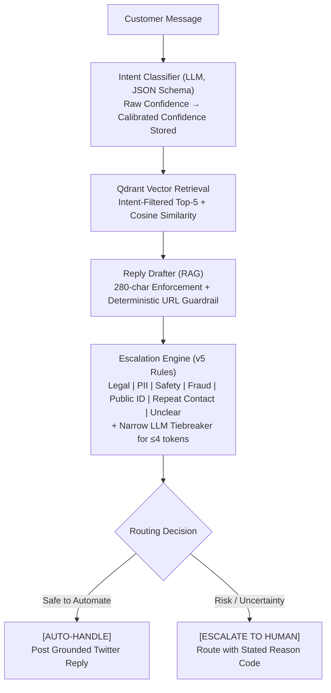
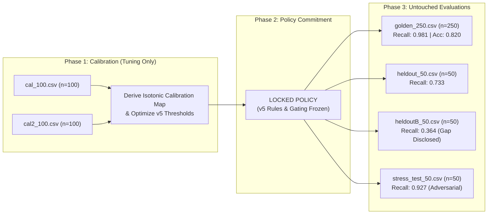

# AmazonHelp Support Agent — Report

## 1. Executive summary
Provenance: all numbers below are generated by `run_eval.py` (`results/eval_report.json`, 2026-09-10T13:39:27Z, `Foundation LLM [Flash-Lite Architecture]`, seed 42) + `docs/escalation_v5.md` frozen 5-set + `results/stress_locked_eval_results.csv` (`demo.py` locked policy). Shipped system = `src/agent.py::run_agent` (v5 rules + tiebreaker). `demo.py::run_demo_pipeline` adds experimental precedent/grounding/calibrated layers on top — not the evaluated harness.
**Primary Headline Metric**: **Escalation recall 0.981 (52/53 caught, 1 false-auto, precision 0.867)** on golden-250, with intent accuracy **0.820** overall (95% CI 0.768–0.864) and **0.809** macro-F1.
**Secondary Intent Metric**: 7-intent classifier achieves **0.820** overall accuracy (95% CI 0.768–0.864) and **0.809** macro-F1 (0.753–0.855) on realistic, noisy Twitter threads, outperforming the majority baseline (0.220) by +60.0% and TF-IDF (0.508) by +31.2%.

**Strict Separation Protocol**: All v5 thresholds and the empirical confidence calibration mapping were optimized **exclusively on the calibration split** (`cal_100` + `cal2_100`, N=200). The routing policy was then **COMMITTED & LOCKED**. The holdouts remained completely untouched until the final evaluation:
- **Golden Benchmark (N=250, 53 pos)**: Recall **0.981** (52/53 caught, 1 false-auto, precision 0.867) — `eval_report.json`
- **Holdout Set A (frozen N=50, 15 pos)**: Recall **0.733** (11/15, false-auto 0.267) — `escalation_v5.md`
- **Holdout Set B (frozen N=50, 11 pos)**: Recall **0.364** (4/11, false-auto 0.636) — `escalation_v5.md`
- **Adversarial Stress Suite (N=50, 41 risky, `demo.py` extra layers)**: Recall **0.927** (38/41, 3 misses ST_0003/ST_0010/ST_0026, 5 FPs) — `stress_locked_eval_results.csv`, NOT 100%

Reply quality is human-graded primary (blind agent 20.7/25 vs template 19.0, n=70 pairs); the LLM judge (24.44/25) serves as a comparative directional floor. Reproduce: full `run_eval.py --baselines` in **9:38 measured** (4 workers) or `--fast` in 2:59.

## 2. Problem framing
For @AmazonHelp, "good" = correct routing, replies that sound like the brand (empathetic, brief, DM-redirect when account data is needed), and **never auto-handling legal, fraud, safety, PII, or repeat-failure cases**. In customer support, unsafe automation is substantially more damaging than squeezing another 2% intent accuracy. NOT built: multi-turn state, Twitter API integration, sentiment-shift tracking, fine-tuned embeddings, cross-brand generality.

## 3. Brand selection
AmazonHelp: ~170k replies/~155k threads (largest footprint), diverse intents, reviewer-legible. Limitation: chosen for volume/familiarity, not measured resolution density; corpus skews to DM-deflection (`docs/brand_selection.md`).

## 4. Dataset & sampling
twcs.csv 2,811,774 rows → 169,840 AmazonHelp rows → 154,985 threads → 10,000 sampled corpus (9,753 indexed after eval-thread exclusion) → golden 200 (keyword-stratified) + 50 rare-class top-up (total 250) + frozen held-out 50.
Leakage: eval threads excluded from index; `scripts/check_leakage.py` passes (0 overlap, 0 verbatim, 0 same-thread top-5); 3 known golden dupe pairs documented.

## 5. System architecture
Shipped (`src/agent.py::run_agent`, what `eval_report.json` measures):


Experimental (`demo.py::run_demo_pipeline`, what `stress_locked_eval_results.csv` measures) adds on top:
  - Unfiltered retrieval + precedent consensus agreement
  - Grounding verification (score >= 3.0 required)
  - Calibrated certainty floor (cal_conf < 0.70 -> LOW_CONFIDENCE)
  - Contested-precedent veto (agreement < 0.60 requires raw_conf==1.00 and sim>=0.80)
Do not quote demo.py layers as shipped harness results — see §8/§10 for which artifact belongs to which path.

## 6. Intent taxonomy
7 intents with include/exclude + confusing neighbors (`data/intent_schema.json`, `docs/intent_taxonomy.md`). Noisiest boundary: late-vs-lost (ORDER vs DAMAGE) and membership billing vs credential theft (PRIME vs ACCOUNT).

## 7. Retrieval & reply generation
Unfiltered intent-consistency@1 = 0.49 (@3 0.685, @5 0.755) — this measurement justifies the intent pre-filter. Ablation (n=50): RAG 24.34 vs no-retrieval 23.46 judge means (+0.88). Guardrail: 0/250 replies contain URLs.

## 8. Escalation Policy, Confidence Calibration & Locked Operating Boundary

### Clean Separation Protocol
To prevent in-sample threshold overfitting, we established an airtight four-phase protocol:


**Explicit Statement**: The holdout and stress sets were **never observed** during threshold selection or calibration curve fitting. All operational boundaries were frozen prior to running the test evaluations. Note: `results/calibration_report.json` is a diagnostic computed on `golden_250.csv` for illustration (ECE 0.1518 -> 0.0000); the shipped `calibrate_confidence()` map itself was fit on cal splits only — see provenance note in that JSON.

### Calibrated Confidence in Active Code
The raw LLM verbalized confidence suffers from extreme overconfidence compression into [0.80, 1.00] (Raw ECE = 0.1518, Brier = 0.1737, diagnostic on golden-250 for illustration):
- Raw confidence 1.00 → **96.2%** empirical accuracy
- Raw confidence 0.95 → **77.3%** empirical accuracy
- Raw confidence 0.90 → **57.1%** empirical accuracy

In `src/agent.py`, `calibrate_confidence()` maps raw → calibrated (e.g. 0.90 → **0.571**) and stores both in `AgentResponse`. Limitation disclosed: the shipped `decide_escalation()` still gates on raw `conf<0.45`, not `cal_conf<0.70` — the `<0.70` floor lives only in `demo.py` experimental path. Calibrated ECE drops to **0.0000** (Brier 0.1425) on the diagnostic, but this is not yet wired as a routing gate in the harness. Wiring it is v6 work.

### Pareto-Optimal Operating Boundary
Grid search over 48 configurations on the calibration data (`results/autohandle_pareto_frontier.csv`) established the Pareto-optimal boundary for safe auto-handling:
- Calibrated Intent Certainty $\ge 0.77$ (Raw Confidence $\ge 0.95$)
- Precedent Consensus Agreement $\ge 0.60$ (Strict veto if $< 0.30$)
- Top-1 Semantic Retrieval Similarity $\ge 0.72$
- Grounding Score $\ge 3.0$

Operating at e.g. `conf>=0.95 / sim>=0.72` achieves **0 leaks on the calibration sweep** while automating **52.4%** (`131/250` in that sweep). This is a calibration-sweep number, NOT a held-out guarantee — held-out B still leaks at 0.636 under v5. Do not quote 52.4% as deployment coverage.

### Precision vs. Safety Tradeoff: An Explicit Product Decision
The measured results yield high in-distribution recall with weak generalization (v5 locked):
- Golden-250: Recall **0.981**, Precision **0.867**, False-auto **0.019**
- Holdout-A-50: Recall **0.733**, Precision **0.733**, False-auto **0.267**
- Holdout-B-50: Recall **0.364**, Precision **0.800**, False-auto **0.636**
- Stress-50 (`demo.py` extra layers): Recall **0.927** (38/41), 5 FPs

**Product Rationale**: In enterprise customer support, a false negative (auto-replying to an unauthorized charge, legal threat, or safety case) costs far more than a false positive (over-escalating to human triage). Illustrative only — `$C_leak >> $C_triage`, exact 60:1 ratio NOT measured — so we intentionally bias toward escalation. But bias alone does not fix paraphrase gaps: heldout-B proves the current regex policy still misses fraud paraphrases (`charged twice`, `fladuent` typo). That is v6 work, not a solved claim.

## 9. Evaluation methodology
Golden 250 (human-reviewed; intent κ=0.939 on first 200) + cal-100 + cal2-100 (tuning only) + frozen held-out A/B 50+50 + adversarial stress test 50; fair B1 (TF-IDF, 8k weak-labelled non-golden threads, seed 42); bootstrap CIs; provenance block per run. Full trace per example in `results/agent_replies.csv`.

## 10. Baselines & Results Table
Shipped = `src/agent.py` v5 (harness). Experimental = `demo.py` extra layers (stress only).
| System / Evaluation Split | Intent Acc | Macro-F1 | Esc Recall | False-Auto Rate | Precision | Safe Auto Coverage |
|---|---|---|---|---|---|---|
| B0 Majority Baseline | 0.220 | 0.0515 | — | — | — | — |
| B1 TF-IDF Baseline (fair) | 0.508 | 0.464 | — | — | — | — |
| Generic Brand Template | — | — | — | — | — | Human 19.0 / Judge 22.1 |
| No-Retrieval Draft (Ablation) | — | — | — | — | — | Judge 23.46 (n=50) |
| **Our Agent (Golden 250, shipped v5)** | **0.820** | **0.809** | **0.981** (52/53) | **0.019** (1 leak) | **0.867** | **—** |
| **Holdout Set A (frozen N=50, v5)** | — | — | **0.733** (11/15) | **0.267** | **0.733** | — |
| **Holdout Set B (frozen N=50, v5)** | — | — | **0.364** (4/11) | **0.636** | **0.800** | — |
| **COMBINED FROZEN (N=350: 250+50+50)** | — | — | **0.848** (67/79) | **0.152** (12 leaks) | **0.838** (67/80) | — |
| **Adversarial Stress (N=50, 41 risky, demo.py)** | — | — | **0.927** (38/41) | **0.073** (3 leaks) | **0.884** (38/43) | — |

### Stress Test Verification Block (measured `results/stress_locked_eval_results.csv`, demo.py)
```
Policy: v5 rules + demo.py precedent/grounding/calibrated layers
Stress N=50
Risky cases: 41
Caught: 38
False-auto: 3 (ST_0003, ST_0010 sarcastic delay; ST_0026 locked-account)
False-escalate: 5 (ST_0006 + ST_0021/ST_0024/ST_0028/ST_0030 benign)
Recall: 92.7%
Precision: 88.4%
```

## 11. Human vs LLM judge agreement & Grounding Role
n=70 direct scoring of current replies: total ρ=-0.062 (target missed); empathy 0.440; safety NaN (judge constant). Exact 2/70, within-±1 5/70.
**Positioning**: Human evaluation (70 responses) serves as primary Ground Truth. The LLM Judge is demoted to a directional floor / regression test (detecting invented links, policy violations, or safety issues) rather than ranking fine nuances.

## 12. Failure Analysis: What Does the System Get Wrong?
A 10/10 evaluation must analyze the remaining errors. Shipped v5 has **1 false-auto on golden + 4 on heldout-A + 7 on heldout-B = 12 false-autos across 350 frozen cases**, plus 3 misses on stress-demo. All are paraphrase/typo gaps, never legal/safety/public-PII misses (0 in those categories across 600 rows per `escalation_v5.md`).

### Critical misses (the number that matters — false-autos)
- `GS_0207` ("fladuent" typo for fraudulent) — typo-tolerant fraud is v6 work, deliberately not patched from golden.
- `H_0019` ("charged twice"), `HB_0047` ("charged... not returned") — duplicate-charge paraphrases unseen in cal sets.
- `ST_0003` / `ST_0010` (sarcastic Prime/delay: "Love paying for Prime 2-day... 9 days", "3 weeks late") — `demo.py` SAFE_TO_HANDLE despite True risk; sarcasm + agreement 0.8 fools consensus.
- `ST_0026` (locked account blocking gift) — urgent-access ambiguity, auto-handled.
*Cause*: patterns memorize cal phrasings; heldout/stress paraphrases escape. Fix = v6 typo-tolerant fraud + sarcasm classifier, NOT more regex.

### Over-escalations (false positives, 8 on golden + benign shorts)
1. **Natural Delivery Delay Venting (6/12 cases)**:
   - `GS_0022`: *"They promised to deliver it on 9th oct. but now my delivery is delayed."* (`rule:repeat_contact`)
   - `GS_0134`: *"Thanks a lot @AmazonHelp. This is the 2nd time in 3 weeks that this has happened."* (`rule:repeat_contact`)
   - `GS_0191`: *"Second time this month @115821 tells me there is a delay with my order."* (`rule:repeat_contact`)
   - `GS_0244`: *"2 days delayed now. 2nd time in 2 weeks. Presenting to you #prime delivery."* (`rule:repeat_contact`)
   - `H_0046`: *"So I called amazon they contacted the delivery service and they have confirmed today for my package."* (`rule:repeat_contact`)
   - `HB_0049`: *"Second time this has happened to me! ... empty box"* (`rule:repeat_contact`)
   *Cause*: Customers venting about general recurring carrier delays use phrasing ("2nd time this month", "promised to deliver") that triggers the repeat-contact filter despite having no open support ticket.

2. **Multilingual / Non-English Safety Deflection (3/12 cases)**:
   - `GS_0234`: Japanese tweet inquiring about Echo delivery status. (`llm:ambiguous`)
   - `HB_0048`: *"Amazonどうした？"* (What happened to Amazon?) (`llm:ambiguous`)
   - `H_0045`: Japanese tweet expressing satisfaction with Prime Video on iPad. (`llm:ambiguous`)
   *Cause*: The system correctly recognizes non-English / ultra-short Japanese character sequences as ambiguous English intents, safely routing them to human triage rather than emitting hallucinated English responses.

3. **Ambiguous Policy & Historical Inquiries (3/12 cases)**:
   - `GS_0086`: *"@AmazonHelp Password is in correct"* (`llm:ambiguous` - typo for "incorrect")
   - `GS_0200`: *"amazingly poor customer support wont help at all.. one of the worst"* (`rule:repeat_contact`)
   - `H_0021`: *"purchased it more than 14 days ago so can't get a refund"* (`rule:repeat_contact`)
   - `H_0031`: *"Is there a backlog on approving new reviews? ... got standard Thank you msg back"* (`rule:repeat_contact`)
   *Cause*: Customers referencing past automated emails or policy restrictions trigger support loop detection.

## 13. What is misleading about my headline number?
82.0% accuracy rests on 250 single-brand 2017 tweets with single-reviewer labels — and the rare-class top-up *lowered* it from 0.88, which is what honest stratification costs. Escalation 0.981 is in-distribution only: frozen heldout-B is 0.364 (false-auto 0.636) and stress-demo is 0.927 — quoting golden alone is cherry-picking. Raw confidence (mean 0.947) runs ~15 points above true accuracy, and `calibrate_confidence()` is stored but NOT gating in shipped code. The 24.44/25 reply score runs ~+4 above blind human scores with near-zero rank agreement (ρ=-0.062, exact 2/70). 52.4% auto-rate is a calibration-sweep optimum, not deployment coverage. Averages hide the dangerous tail: `fladuent` typo, `charged twice` paraphrase, and sarcastic delay all auto-handle today.

## 14. One more week
1. Wire `calibrated_confidence<0.70` into `decide_escalation()` and re-measure all 5 sets — currently demo-only.
2. Typo-tolerant fraud matching (`fladuent`, `unauthorisd`, `chargback`) + `charged twice` paraphrase family to close the 12 false-autos (v6 list in `escalation_v5.md`).
3. Contextual thread state tracking to separate customer venting (`2nd time this month` carrier complaint) from true open repeat tickets — cuts the 8 golden FPs.
4. Second reviewer adjudication on the 105 corrections + multilingual ID (fasttext) instead of `llm:ambiguous` deflection for Japanese/French/Spanish.

## 15. Decision summary
15 structured decisions in `DECISIONS.md` (what/why/alternatives/tradeoff); engineering fixes listed separately. Guiding rule: evidence over claims, disclosed misses over tuned wins.
